<h1>2019-2-OSSPC-mustard-4</h1>

##License
	
<a href="https://opensource.org/licenses/MIT">The MIT License </a>

##Developers
±è¹Î½Ä(ÆÀÀå) 
°æÁ¦ÈÆ 
·ùÈ­µ¿  
Á¤Çѱ³  

##Description

 Three Game Modes
	-nomal mode
	-map mode : Move to the next step when removing all map blocks. Maps in 6 stages
	-tima attack mode : We can play games for 2 minutes.

 If you play a game after logging in, you can register the Tetris record and check the ranking
	- If you want to see the ranking of all users, visit website : <a href="http://15.164.218.103/home.php">Muxgtard Tetris</a>

 blocks are added below for level 15 or higher.

 The higher the level, the faster the block falls.

##Develope environment and IDE

OS
	 Windows 10, Ubuntu (Linux)
IDE
	 eclipse, phpStorm

##What Improved?

##Screenshot
	
- Login & Register

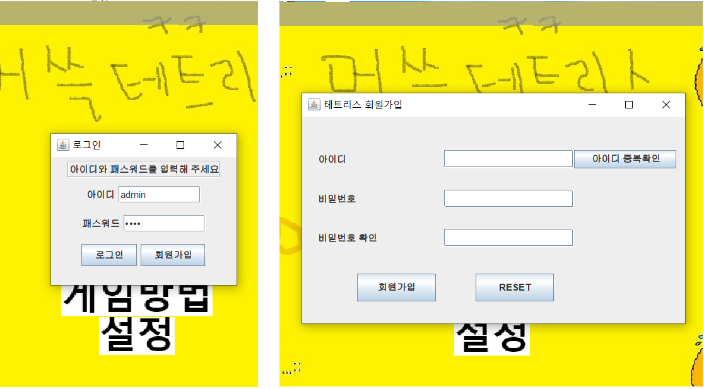

$ git commit -m 'readme.md ¼öÁ¤'
On branch master
Your branch is ahead of 'origin/master' by 1 commit.

- Ranking site

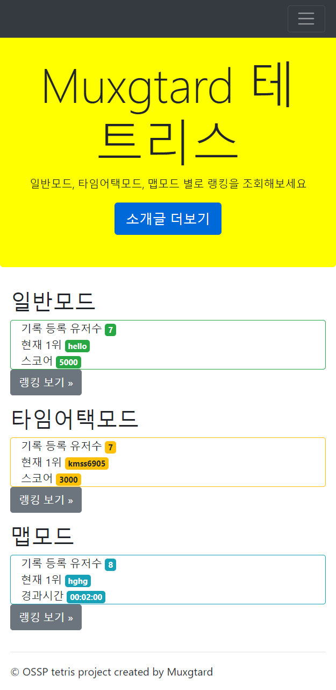 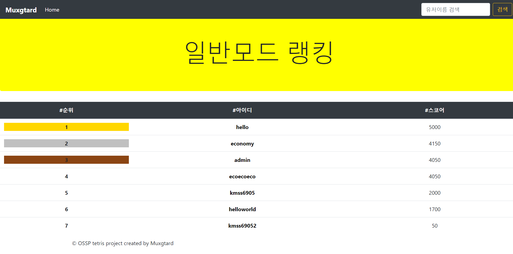 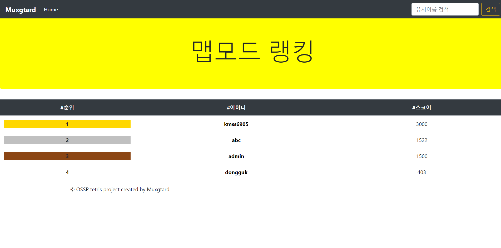 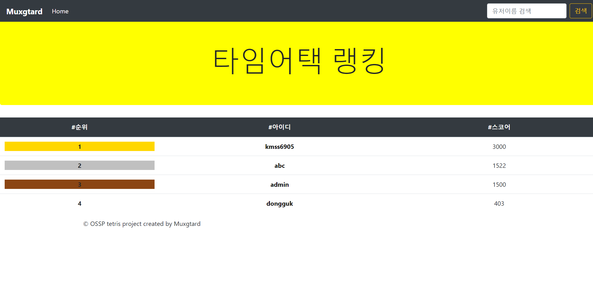 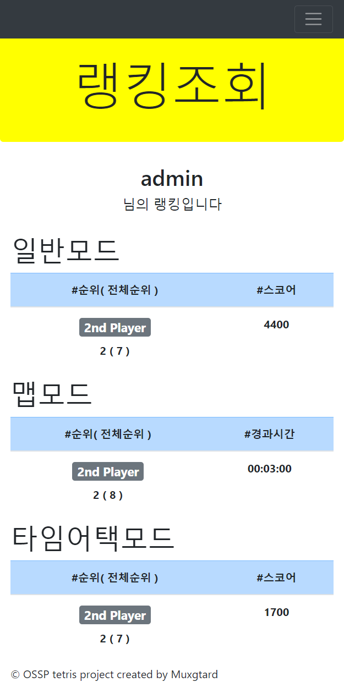 
- MapMode( six map )

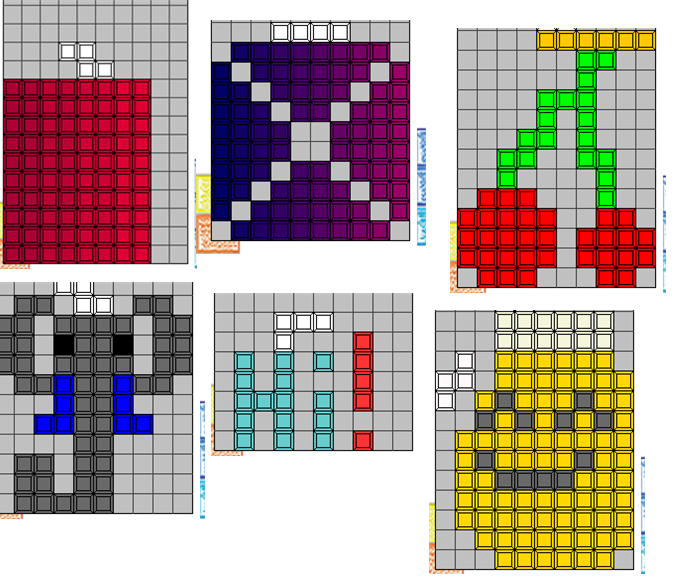

- UI & UX

: Change Home screen
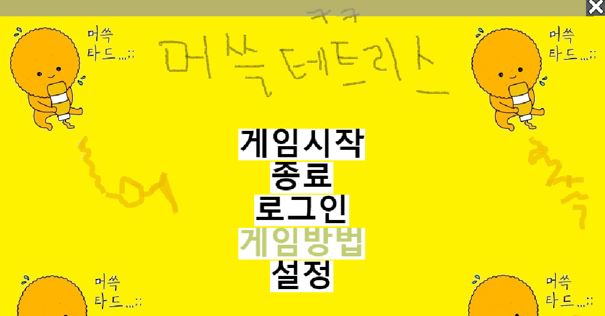
	
: Add reverse mode setting
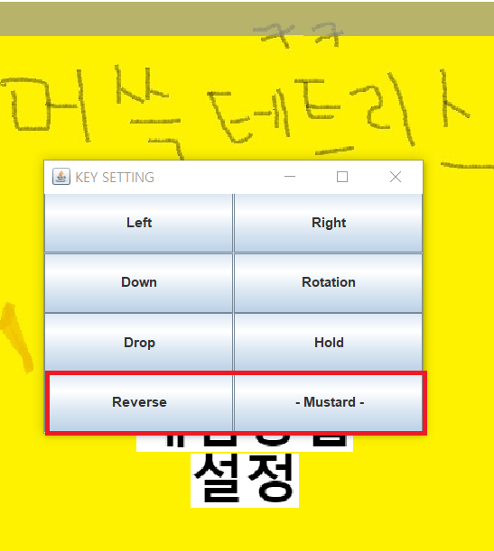

: How to play window

: Game result window
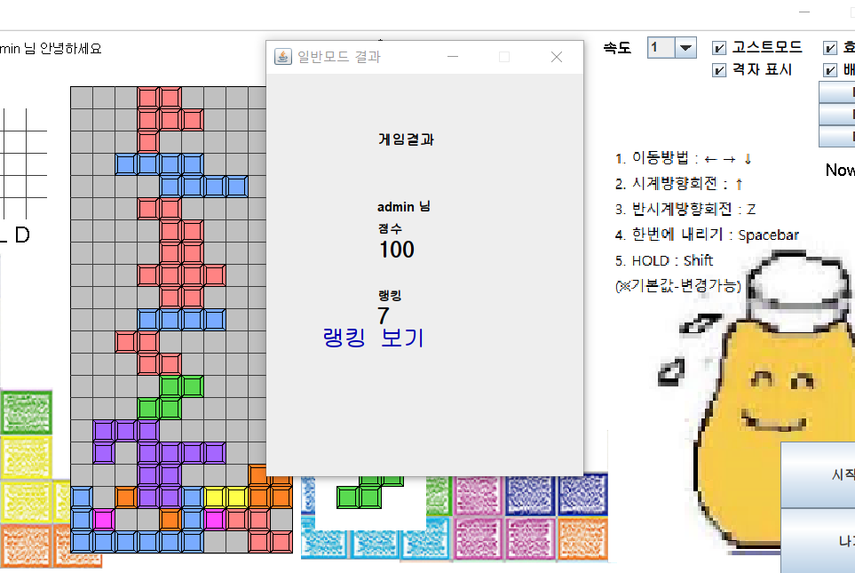

: Game mode selection window
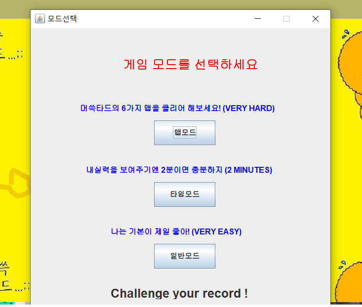

: change board background
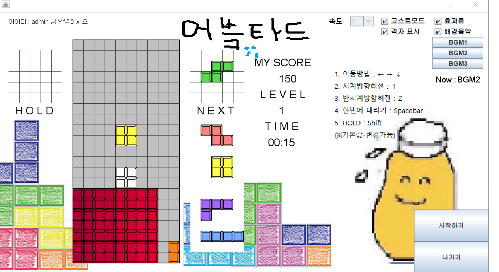

